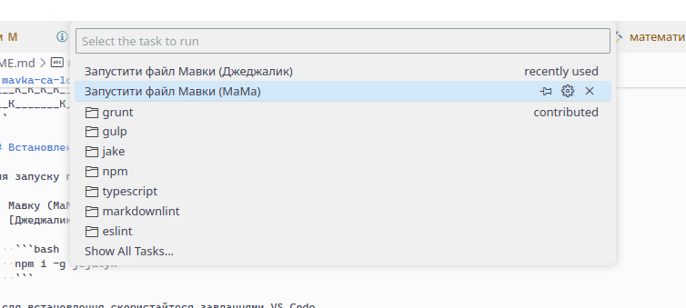
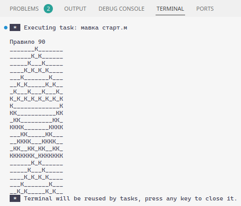

# mavka-ca-1d

> **Note**
> На даний момент проєкт може знаходитись у неробочому стані.
> Вирішення помилок незабаром.

Клітинковий автомат у [Мавці](https://xn--80aaf6ah.xn--j1amh/).

Приклад виводу для параметрів:

```text
правило = 90
початковий_стан = [0, 0, 0, 0, 0, 0, 0, 1, 0, 0, 0, 0, 0, 0, 0]
```

```text
Правило 90
_______К_______
______К_К______
_____К___К_____
____К_К_К_К____
___К_______К___
__К_К_____К_К__
_К___К___К___К_
К_К_К_К_К_К_К_К
К_____________К
КК___________КК
_КК_________КК_
КККК_______КККК
___КК_____КК___
__КККК___КККК__
_КК__КК_КК__КК_
ККККККК_ККККККК
______К_К______
_____К___К_____
____К_К_К_К____
___К_______К___
```

## Встановлення

Для запуску проекту необхідно встановити одну з двох опцій:

1. Мавку (МаМа) з [релізів](https://github.com/mavka-ukr/mavka/releases) у репозиторії.
2. [Джеджалик](https://www.npmjs.com/package/jejalyk) за допомогою NPM:

    ```bash
    npm i -g jejalyk
    ```

Після встановлення скористайтеся завданнями VS Code,
натиснувши комбінацію клавіш `Ctrl+Shift+P` та ввівши `Task`.
Оберіть `Tasks: Run Task` та оберіть бажану опцію запуску:



Результат запуску зʼявиться у новому вікні терміналу:



Ви також можете виконати команду запуску самостійно для кожної опції відповідно:

1. Для Мавки (МаМа):

    ```bash
    мавка старт.м
    ```

2. Для Джеджалика:

    ```bash
    джеджалик старт старт.м
    ```
